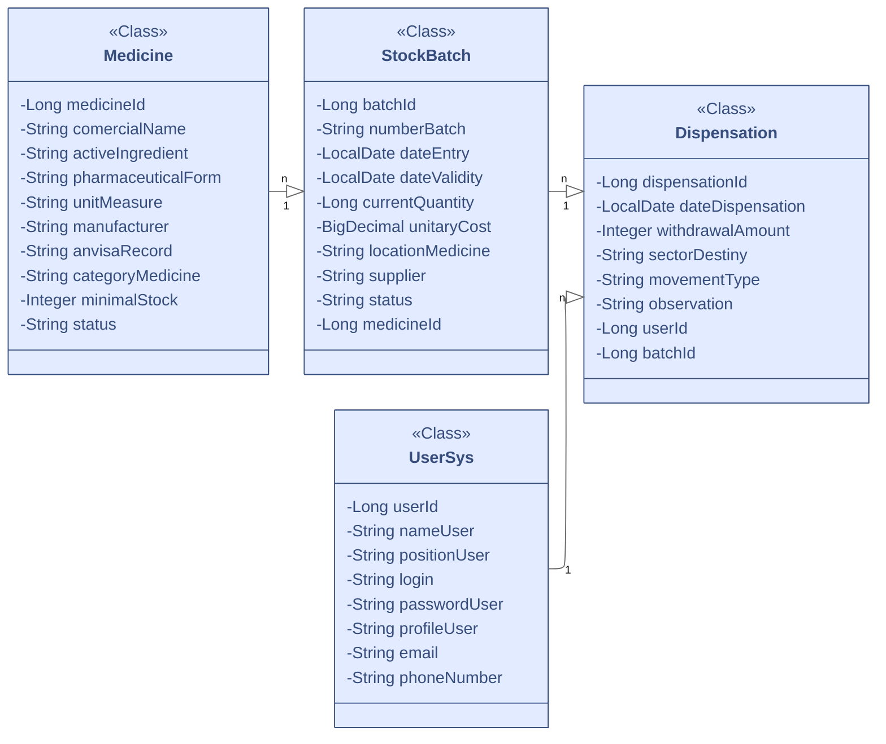

# 🩺 MedSave: Controle Inteligente, Saúde Eficiente.

> **Prevenção de perdas e otimização de compras em tempo real. A inteligência que a sua gestão de estoque hospitalar precisa.**

A **MedSave** é uma plataforma robusta de **Business Intelligence (BI)** que transforma dados de estoque em **alertes estratégicos**. Desenvolvida para prevenir perdas por vencimento e ruptura de estoque, a MedSave garante a disponibilidade de suprimentos essenciais e maximiza a eficiência operacional.

---

## ✨ Destaques da Plataforma

| Funcionalidade | Descrição |
| :--- | :--- |
| 🚨 **Alertas Inteligentes** | Notificações em tempo real sobre lotes próximos ao vencimento e estoques mínimos. |
| 💸 **Otimização de Compras** | Sugestões de pedidos baseadas em padrões de consumo histórico e níveis de segurança. |
| 🔍 **Rastreabilidade Total** | Controle completo sobre a entrada, localização e dispensa de cada lote de medicamento. |
| 📊 **Relatórios Gerenciais** | Dashboards em Oracle Apex para tomada de decisão estratégica e *compliance*. |

---

## 🏗️ Arquitetura e Tecnologia

A MedSave adota uma arquitetura moderna e escalável, utilizando o melhor de cada tecnologia:

* **Frontend & BI:** **Oracle Apex**
* **Backend & Microserviços:** **Java** e **C#**

---

## 🤝 Integrantes do Projeto

### `descricaoIntegrantes`

*Insira aqui a lista de membros da equipe, com nomes e funções, em formato de lista (ex: - Nome Sobrenome: Função)*

---

## 📅 Cronograma

### `fotoCronograma`

*Insira aqui o link ou a tag HTML para a imagem do cronograma do projeto.*

---

## 🎬 Demonstração da Plataforma

Veja como o MedSave funciona na prática, transformando o caos do estoque em clareza estratégica.

▶️ [**Assista ao nosso vídeo demonstrativo no YouTube**](linkDoVideoYt)

---

## 📐 Modelagem de Dados

### 🎨 Diagrama de Classes (UML - Mermaid)

O diagrama abaixo representa as principais entidades e seus relacionamentos no ecossistema MedSave.

### 🗃️ Diagrama de Entidade-Relacionamento (DER)

### `fotoDer`

---

## 🌐 Mapeamento de Endpoints (API REST)

Os microserviços de backend são acessados através da nossa API REST. Abaixo está o mapeamento dos principais *endpoints*.

### `mapeamento dos endpoints`

*Insira aqui a documentação da API (endpoints, métodos HTTP e descrições).*
