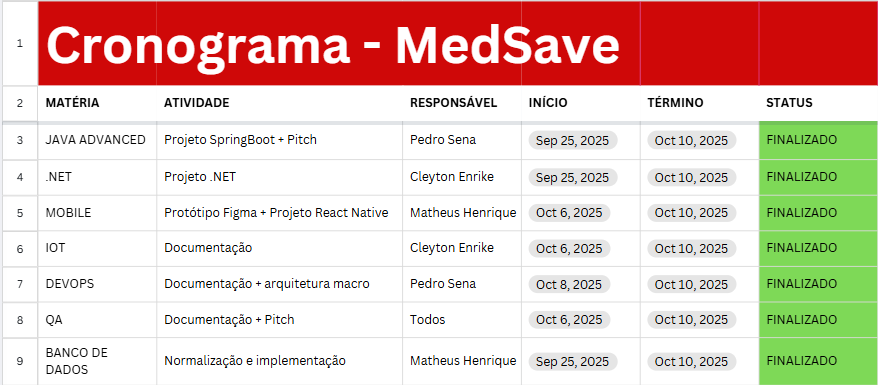
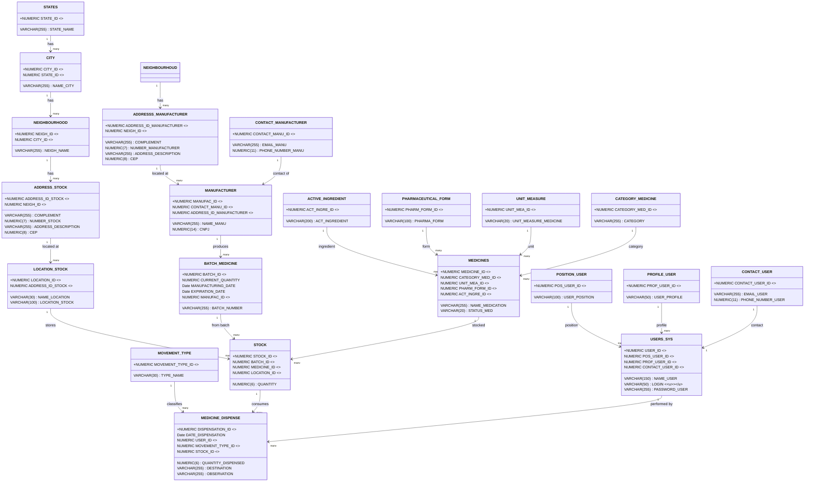
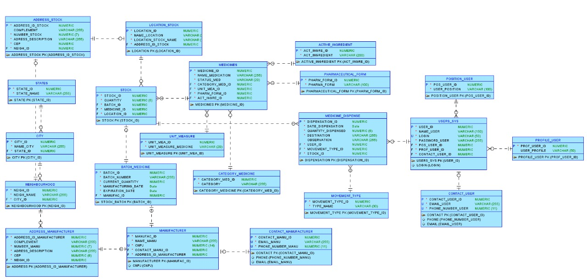

# 🩺 MedSave: Controle Inteligente, Saúde Eficiente.

> **Prevenção de perdas e otimização de compras em tempo real. A inteligência que a sua gestão de estoque hospitalar precisa.**

A **MedSave** é uma plataforma robusta de **Business Intelligence (BI)** que transforma dados de estoque em **alertes estratégicos**. Desenvolvida para prevenir perdas por vencimento e ruptura de estoque, a MedSave garante a disponibilidade de suprimentos essenciais e maximiza a eficiência operacional.

---

## ✨ Destaques da Plataforma

| Funcionalidade | Descrição |
| :--- | :--- |
| 🚨 **Alertas Inteligentes** | Notificações em tempo real sobre lotes próximos ao vencimento e estoques mínimos. |
| 💸 **Otimização de Compras** | Sugestões de pedidos baseadas em padrões de consumo histórico e níveis de segurança. |
| 🔍 **Rastreabilidade Total** | Controle completo sobre a entrada, localização e dispensa de cada lote de medicamento. |
| 📊 **Relatórios Gerenciais** | Dashboards em Oracle Apex para tomada de decisão estratégica e *compliance*. |

---

## 🏗️ Arquitetura e Tecnologia

A MedSave adota uma arquitetura moderna e escalável, utilizando o melhor de cada tecnologia:

* **Frontend & BI:** **Oracle Apex**
* **Backend & Microserviços:** **Java** e **C#**
* **Mobile:** **React Native**
* **Banco de Dados:** **Oracle DB**
* **Cloud:** **Oracle Cloud Infrastructure**

---

## 🤝 Integrantes do Projeto

| Nome                                  | Função no Projeto          | LinkedIn | GitHub |
|---------------------------------------|----------------------------|----------|--------|
| Cleyton Enrike de Oliveira            | Desenvolvedor .NET & IOT   | [LinkedIn](https://www.linkedin.com/in/cleyton-enrike-de-oliveira99) | [@Cleytonrik99](https://github.com/Cleytonrik99) |
| Matheus Henrique Nascimento de Freitas| Desenvolvedor Mobile & DBA | [LinkedIn](https://www.linkedin.com/in/matheus-henrique-freitas)     | [@MatheusHenriqueNF](https://github.com/MatheusHenriqueNF) |
| Pedro Henrique Sena                   | Desenvolvedor Java & DevOps| [LinkedIn](https://www.linkedin.com/in/pedro-henrique-sena)          | [@devpedrosena1](https://github.com/devpedrosena1) |

---

## 📅 Cronograma

  

---

## 🎬 Pitch

▶️ [**Assista ao nosso vídeo demonstrativo no YouTube**](linkDoVideoYt)

---

## 📐 Modelagem de Dados

### 🎨 Diagrama de Classes (UML - Mermaid)

O diagrama abaixo representa as principais entidades e seus relacionamentos no ecossistema MedSave.

---

### 🗃️ Diagrama de Entidade-Relacionamento (DER)

  

---

## 🌐 Mapeamento de Endpoints (API REST)

Os microserviços de backend são acessados através da nossa API REST. Abaixo está o mapeamento dos principais *endpoints*.

## Medicines ("/api/medicines")

| Método | Endpoint                                   | Funcionalidade                                                   |
|--------|--------------------------------------------|------------------------------------------------------------------|
| GET    | `/api/medicines`                           | Retorna todos os medicamentos.                                   |
| GET    | `/api/medicines/{id}`                      | Retorna um medicamento específico por ID.                        |
| POST   | `/api/medicines`                           | Cadastra um novo medicamento.                                    |
| DELETE | `/api/medicines/{id}`                      | Remove um medicamento por ID.                                    |
| DELETE | `/api/medicines/removeObject`              | Remove todos os medicamentos.                                    |
| PUT    | `/api/medicines/{id}`                      | Atualiza um medicamento específico por ID                        |

## Medicines ("/api/medicines")

| Método | Endpoint                                   | Funcionalidade                                                   |
|--------|--------------------------------------------|------------------------------------------------------------------|
| GET    | `/api/medicines`                           | Retorna todos os medicamentos.                                   |
| GET    | `/api/medicines/{id}`                      | Retorna um medicamento específico por ID.                        |
| POST   | `/api/medicines`                           | Cadastra um novo medicamento.                                    |
| DELETE | `/api/medicines`                           | Remove um medicamento por ID.                                    |
| DELETE | `/api/medicines/removeObject`              | Remove todos os medicamentos.                                    |
| PUT    | `/api/medicines/{id}`                      | Atualiza um medicamento específico por ID                        |

