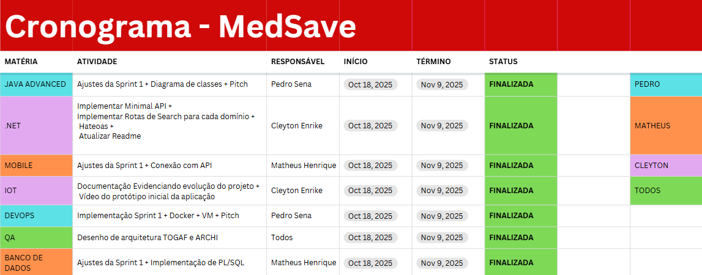
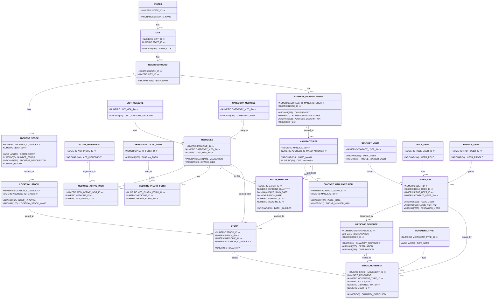
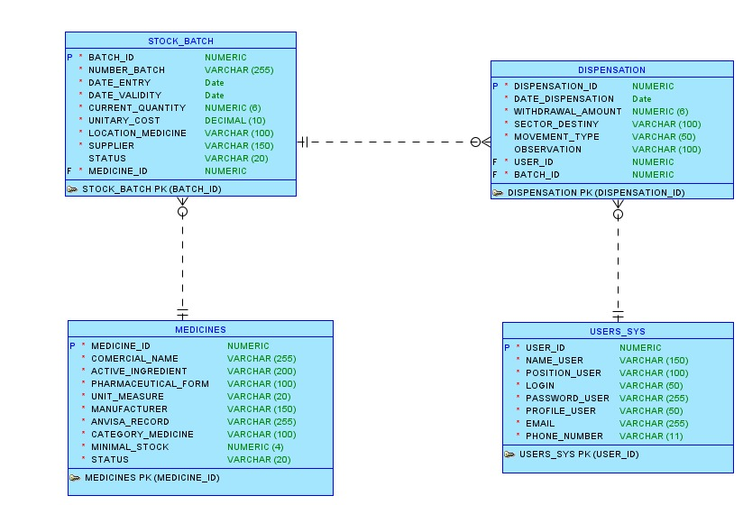

# 🩺 MedSave: Controle Inteligente, Saúde Eficiente.

> **Prevenção de perdas e otimização de compras em tempo real. A inteligência que a sua gestão de estoque hospitalar precisa.**

A **MedSave** é uma plataforma robusta de **Business Intelligence (BI)** que transforma dados de estoque em **alertes estratégicos**. Desenvolvida para prevenir perdas por vencimento e ruptura de estoque, a MedSave garante a disponibilidade de suprimentos essenciais e maximiza a eficiência operacional.

---

## ✨ Destaques da Plataforma

| Funcionalidade | Descrição |
| :--- | :--- |
| 🚨 **Alertas Inteligentes** | Notificações em tempo real sobre lotes próximos ao vencimento e estoques mínimos. |
| 💸 **Otimização de Compras** | Sugestões de pedidos baseadas em padrões de consumo histórico e níveis de segurança. |
| 🔍 **Rastreabilidade Total** | Controle completo sobre a entrada, localização e dispensa de cada lote de medicamento. |
| 📊 **Relatórios Gerenciais** | Dashboards em Oracle Apex para tomada de decisão estratégica e *compliance*. |

---

## 🏗️ Arquitetura e Tecnologia

A MedSave adota uma arquitetura moderna e escalável, utilizando o melhor de cada tecnologia:

* **Frontend & BI:** **Oracle Apex**
* **Backend & Microserviços:** **Java** e **C#**
* **Mobile:** **React Native**
* **Banco de Dados:** **Oracle DB**
* **Cloud:** **Oracle Cloud Infrastructure**

---

## 🤝 Integrantes do Projeto

| Nome                                  | Função no Projeto          | LinkedIn | GitHub |
|---------------------------------------|----------------------------|----------|--------|
| Cleyton Enrike de Oliveira            | Desenvolvedor .NET & IOT   | [LinkedIn](https://www.linkedin.com/in/cleyton-enrike-de-oliveira99) | [@Cleytonrik99](https://github.com/Cleytonrik99) |
| Matheus Henrique Nascimento de Freitas| Desenvolvedor Mobile & DBA | [LinkedIn](https://www.linkedin.com/in/matheus-henrique-freitas)     | [@MatheusHenriqueNF](https://github.com/MatheusHenriqueNF) |
| Pedro Henrique Sena                   | Desenvolvedor Java & DevOps| [LinkedIn](https://www.linkedin.com/in/pedro-henrique-sena)          | [@devpedrosena1](https://github.com/devpedrosena1) |

---

## 📅 Cronograma

<div align="center">
  
</div>

---

## 🎬 Pitch

▶️ [**Assista ao vídeo da nossa solução**](https://youtu.be/jCSo9ISv7RY)

---

##  Modelagem de Dados

### 🎨 Diagrama de Classes (UML - Mermaid)

O diagrama abaixo representa as principais entidades e seus relacionamentos no ecossistema MedSave.



---

### 🗃️ Diagrama de Entidade-Relacionamento (DER)

<div align="center">
  
</div>

---
## ✨ Tecnologias


- **Java 21**
- **Spring Boot 3.5**
- **Spring Data JPA**
- **H2 Database** (banco de dados local para testes)
- **Oracle DB** (banco de dados real/final)
- **Maven** (gerenciador de dependências)
- **Springdoc OpenAPI** (documentação Swagger UI)
- **Docker** (microserviços)
---

---

# 🚀 Como Executar Localmente

## **Pré-requisitos**

Antes de rodar o projeto, certifique-se de ter os seguintes softwares instalados:

- **[Java 21+](https://www.oracle.com/java/technologies/javase/jdk21-archive-downloads.html)**
- **[Maven 3.9+](https://maven.apache.org/download.cgi)**

---

## **Passos para Instalação e Execução**

### 1. **Clonar o repositório**

```bash
git clone https://github.com/oraclechallenge1/Oracle-Java-Advanced.git
```

### 2. **Acesse a pasta do projeto**

```bash
cd ProjectMedSave
```

### 3. **Compile o projeto**

```bash
mvn clean install
```
### 4. **Execute o projeto**

```bash
mvn spring-boot:run
```

O projeto iniciará em:  

👉 [http://localhost:8080](http://localhost:8080)

A documentação Swagger estará disponível em:  

👉 [http://localhost:8080/swagger-ui.html](http://localhost:8080/swagger-ui.html)

---
# 🚀 Como Executar o Docker

### 1. **Dê um pull na imagem docker**

```bash
docker pull devpedrosena1/project-med-save:2.0
```

### 2. **Rode o container**

```bash
docker run -p 8080:8080 project-med-save:2.0
```

O projeto iniciará em:  

👉 [http://localhost:8080](http://localhost:8080)

A documentação Swagger estará disponível em:  

👉 [http://localhost:8080/swagger-ui.html](http://localhost:8080/swagger-ui.html)

---

## 🌐 Mapeamento de Endpoints (API REST)

Os microserviços de backend são acessados através da nossa API REST. Abaixo está o mapeamento dos principais *endpoints*.

Caso queria uma outra opção de acesso as APIs, clique no link abaixo.

[Requisições via Postman](https://www.postman.com/pedrosena-442731/workspace/pedro-sena-s-workspace/collection/44355033-bd106e60-d82f-4d66-8015-839e5baae611?action=share&source=copy-link&creator=44355033)

"Link" é a âncora para as URIs de cada endpoint.

## Medicines ("/api/v2/medicines")

| Método | Endpoint                                   | Funcionalidade                                                   | URI                             |
|--------|--------------------------------------------|------------------------------------------------------------------|---------------------------------|
| GET    | `/api/v2/medicines`                        | Retorna todos os medicamentos.                                   | [Link](http://localhost:8080/api/v2/medicines)        |
| GET    | `/api/v2/medicines/{id}`                   | Retorna um medicamento específico por ID.                        | [Link](http://localhost:8080/api/v2/medicines/2)   |
| POST   | `/api/v2/medicines`                        | Cadastra um novo medicamento.                                    | [Link](http://localhost:8080/api/v2/medicines)        |
| DELETE | `/api/v2/medicines/{id}`                   | Remove um medicamento por ID.                                    | [Link](http://localhost:8080/api/v2/medicines/16)   |
| PUT    | `/api/v2/medicines/{id}`                   | Atualiza um medicamento específico por ID                        | [Link](http://localhost:8080/api/v2/medicines/2)   |

```bash
{
  "nameMedication": "test1",
  "statusMed": "ativo",
  "activeIngredientIds": [
    1, 4
  ],
  "pharmFormIds": [
    3
  ],
  "categoryMedicineId": 1,
  "unitMeasureId": 1
}
```

## UnitMeasure ("/api/v2/unit-measures")

| Método | Endpoint                                   | Funcionalidade                                                   | URI                             |
|--------|--------------------------------------------|------------------------------------------------------------------|---------------------------------|
| GET    | `/api/v2/unit-measures`                    | Retorna todas as unidades de medida.                             | [Link](http://localhost:8080/api/v2/unit-measures)        |
| GET    | `/api/v2/unit-measure/{id}`                | Retorna uma unidade de medida específica por ID.                 | [Link](http://localhost:8080/api/v2/unit-measure/2)    |
| POST   | `/api/v2/unit-measures`                    | Cadastra uma nova unidade de medida.                             | [Link](http://localhost:8080/api/v2/unit-measures)        |
| DELETE | `/api/v2/unit-measures/{id}`               | Remove uma unidade de medida por ID.                             | [Link](http://localhost:8080/api/v2/unit-measures/16)   |
| PUT    | `/api/v2/unit-measure/{id}`                | Atualiza uma unidade de medida específica por ID                 | [Link](http://localhost:8080/api/v2/unit-measure/2)    |


```bash
{
  "unit": "test1"
}
```

## PharmaceuticalForm ("/api/v2/pharmaceutical-forms")

| Método | Endpoint                                   | Funcionalidade                                                   | URI                             |
|--------|--------------------------------------------|------------------------------------------------------------------|---------------------------------|
| GET    | `/api/v2/pharmaceutical-forms`             | Retorna todas as formas farmacêuticas.                           | [Link](http://localhost:8080/api/v2/pharmaceutical-forms)        |
| GET    | `/api/v2/pharmaceutical-forms/{id}`        | Retorna uma forma farmacêutica específica por ID.                | [Link](http://localhost:8080/api/v2/pharmaceutical-forms/2)   |
| POST   | `/api/v2/pharmaceutical-forms`             | Cadastra uma nova forma farmacêutica.                            | [Link](http://localhost:8080/api/v2/pharmaceutical-forms)        |
| DELETE | `/api/v2/pharmaceutical-forms/{id}`        | Remove uma forma farmacêutica por ID.                            | [Link](http://localhost:8080/api/v2/pharmaceutical-forms/17)   |
| PUT    | `/api/v2/pharmaceutical-forms/{id}`        | Atualiza uma forma farmacêutica específica por ID                | [Link](http://localhost:8080/api/v2/pharmaceutical-forms/2)   |


```bash
{
  "name": "test1"
}
```

## ActiveIngredient ("/api/v2/active-ingredients")

| Método | Endpoint                                   | Funcionalidade                                                   | URI                             |
|--------|--------------------------------------------|------------------------------------------------------------------|---------------------------------|
| GET    | `/api/v2/active-ingredients`               | Retorna todos os ingredientes ativos.                            | [Link](http://localhost:8080/api/v2/active-ingredients)        |
| GET    | `/api/v2/active-ingredients/{id}`          | Retorna um ingrediente ativo específico por ID.                  | [Link](http://localhost:8080/api/v2/active-ingredients/2)   |
| POST   | `/api/v2/active-ingredients`               | Cadastra um novo ingrediente ativo.                              | [Link](http://localhost:8080/api/v2/active-ingredients)        |
| DELETE | `/api/v2/active-ingredients/{id}`          | Remove um ingrediente ativo por ID.                              | [Link](http://localhost:8080/api/v2/active-ingredients/16)   |
| PUT    | `/api/v2/active-ingredients/{id}`          | Atualiza um ingrediente ativo específico por ID                  | [Link](http://localhost:8080/api/v2/active-ingredients/2)   |


```bash
{
  "nameActiveIngre": "test1"
}
```

## CategoryMedicine ("/api/v2/categories")

| Método | Endpoint                                   | Funcionalidade                                                   | URI                             |
|--------|--------------------------------------------|------------------------------------------------------------------|---------------------------------|
| GET    | `/api/v2/categories`                       | Retorna todas as categorias.                                     | [Link](http://localhost:8080/api/v2/categories)        |
| GET    | `/api/v2/categories/{id}`                  | Retorna uma categoria específica por ID.                         | [Link](http://localhost:8080/api/v2/categories/2)   |
| POST   | `/api/v2/categories`                       | Cadastra uma nova categoria.                                     | [Link](http://localhost:8080/api/v2/categories)        |
| DELETE | `/api/v2/categories/{id}`                  | Remove uma categoria por ID.                                     | [Link](http://localhost:8080/api/v2/categories/16)   |
| PUT    | `/api/v2/categories/{id}`                  | Atualiza uma categoria específica por ID                         | [Link](http://localhost:8080/api/v2/categories/2)   |


```bash
{
  "categoryName": "test1"
}
```

## Batch ("/api/v2/batches/receipts")

| Método | Endpoint                                   | Funcionalidade                                                   | URI                             |
|--------|--------------------------------------------|------------------------------------------------------------------|---------------------------------|
| POST   | `/api/v2/batches/receipts`                 | Cria um LOTE.                                                    | [Link](http://localhost:8080/api/v2/batches/receipts)        |

```bash
{
  "batchNumber": "LOTEtest",
  "manufacturingDate": "2025-10-09",
  "expirationDate": "2026-01-01",
  "quantity": 800,
  "medicineId": 2,
  "locationId": 2,
  "manufacturerId": 2
}

```

## Batch ("/api/v2/stock/transfer")

| Método | Endpoint                                   | Funcionalidade                                                   | URI                             |
|--------|--------------------------------------------|------------------------------------------------------------------|---------------------------------|
| POST   | `/api/v2/stock/transfer`                   | Transfere de um estoque para outro.                              | [Link](http://localhost:8080/api/v2/stock/transfer)        |

```bash
{
  "medicineId": 2,
  "batchId": 2,
  "sourceLocationId": 2,
  "destinationLocationId": 13,
  "quantity": 5
}

```

